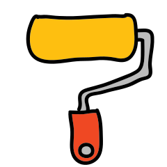

<h1 align="center"><br> Notation Reveal</h1>

<p align="center">
    <a href="https://github.com/namitoyokota/ngx-notation-reveal/blob/master/LICENSE">
        
    </a>
    <a href="https://www.npmjs.com/package/ngx-notation-reveal">
        
    </a>
    <a href="https://www.npmjs.com/package/ngx-notation-reveal">
        
    </a>
</p>

<p align="center">
    Notation Reveal is an Angular component to add the Rough Notation animation when element scrolls into view.
</p>

## Demo

View live demo [here](https://notation-reveal.namitoyokota.com/)!

## Installation

Install using a package manager:

```shell
npm i ngx-notation-reveal
```

or

```shell
yarn add ngx-notation-reveal
```

## Usage

First, import the module.

```typescript
import { NotationRevealModule } from 'ngx-notation-reveal';

@NgModule({
    imports: [NotationRevealModule],
})
export class AppModule {}
```

Next, set up a config property. You can read all annotation types on Rough Notation's official documentation.

```typescript
readonly underline = {
    type: 'underline',
    color: '#F38181',
} as RoughAnnotationConfig;
```

Lastly, add component in the HTML.

```html
<notation-reveal [config]="underline">This sentence will be underlined.</notation-reveal>
```

## Directives

Optionally, override the reset flag to avoid re-animations.

```html
<notation-reveal [reset]="false"></notation-reveal>
```

Delay, set to 1000 milliseconds (1 second) by default, can also be overridden.

```html
<notation-reveal [delay]="5000"></notation-reveal>
```

## License

[MIT](https://github.com/namitoyokota/ngx-notation-reveal/blob/master/LICENSE) &copy; [Namito Yokota](https://www.namitoyokota.com)
